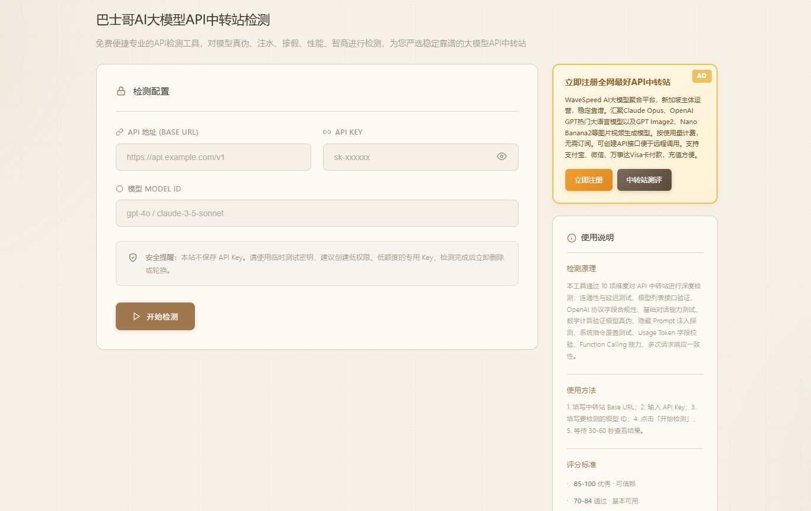

# Bashige LLM  Aggregator Detection Tool

**Bashige LLM Aggregator Detection Tool** is a comprehensive, web-based testing platform designed to evaluate and verify the quality, stability, and authenticity of AI API aggregator platforms. This tool provides professional-grade testing capabilities for users looking for reliable AI API services.

# Core Functionality

The tool benchmarks ten critical dimensions to audit and verify the performance, security, and integrity of AI API aggregators:

1. Connectivity Test: Verifies basic API accessibility, latency, and response viability.
2. Model List Query: Confirms the endpoint's capability to accurately retrieve available models.
3. Protocol Compliance Test: Validates strict implementation of the OpenAI-compatible API protocol.
4. Standard Chat Completion: Evaluates fundamental conversational capabilities and baseline output quality.
5. Model Authenticity Verification: Detects whether the backend provider truly deploys the claimed AI models or placeholders.
6. Hidden Prompt Detection: Identifies if the API provider secretly injects unauthorized system prompts or hidden context.
7. Instruction Injection & Override Test: Checks if the gateway is vulnerable to external prompt injections that override system directives.
8. Usage Field Validation: Audits the accuracy and existence of returned token consumption statistics.
9. Function Calling Capability: Tests complex tool-calling workflows, object parameters, and multi-turn schema handling.
10. Response Consistency Analysis: Evaluates output stability and structural alignment across multiple identical requests.

## Detection Principles

The core methodology is built on rigorous, behavioral-driven API auditing principles:

- Direct API Access: Establishes direct end-to-end communication with the target endpoint via its OpenAI-compatible interface, eliminating intermediate proxy interference.
- Behavioral Analysis: Executes real-time dynamic probing based on actual API runtime responses rather than unreliable static inspection.
- Comparative Benchmarking: Fires multiple identical or adversarial requests to actively isolate anomalies and verify structural output consistency.
- Parameter Cross-Validation: Audits critical response fields—such as token consumption statistics—against mathematical baselines to ensure billing transparency.
- Protocol Compliance Enforcement: Benchmarks the endpoint against strict OpenAI API specifications to ensure flawless ecosystem integration.

## Usage Method

### Quick Start

To run your first audit, navigate to the main detection page and input your configuration details, including the base URL, API key, and the specific model ID you wish to benchmark.

Once your credentials are set, simply click the "Start Detection" (开始检测) button to initiate the comprehensive evaluation pipeline. The system will automatically execute all active probing vectors in real time, after which you can immediately analyze the detailed test reports, security logs, and overall performance scores directly on your dashboard.

### Detailed Configuration

To initiate a benchmark, you will need to provide three core endpoints on the dashboard: the Base URL representing your target API endpoint (e.g., https://api.example.com/v1), a valid API Key for bearer authentication, and the specific Model ID you wish to audit.

Security Notice: To safeguard your account infrastructure, we highly recommend using temporary API keys with strictly limited permissions or low-balance quotas for all detection sessions. Your credentials are used solely for real-time protocol probing and are never stored on our servers.

### Key Features

The detection engine operates with complete transparency, delivering a real-time visual progress pipeline and comprehensive diagnostic logging for every probing vector executed during the evaluation. As the session runs, the platform automatically tracks underlying token consumption statistics to cross-examine telemetry data and uncover billing anomalies instantly.

Upon completion, the system synthesizes these metrics into an actionable risk assessment report—exposing hidden system prompts, model-spoofing flags, or protocol non-compliance. All findings are calculated into a final, weighted performance score, prioritizing critical security and authenticity dimensions over standard latency baselines to give you a definitive verdict on your API provider.

### Security & Precautions

To ensure absolute infrastructure security, users must treat all operational credentials with the utmost discretion. The platform strictly enforces real-time runtime memory processing—meaning your configurations are never written to permanent disk storage. However, as an industry-standard zero-trust baseline, we strongly recommend deploying temporary, low-privilege API keys backed by strict budget quotas for all evaluation sessions.

Once your detection pipeline is complete, the most secure practice is to immediately revoke or rotate the keys within your provider's dashboard. Utilizing disposable, short-lived tokens minimizes potential credential exposure and maintains total perimeter defense while auditing untrusted third-party API gateways.

## Testing Guidelines

When executing continuous evaluation sessions, please be aware that firing multiple high-frequency requests may accidentally trigger the target provider's anti-scraping or rate-limiting protocols. Since each probing vector actively consumes live tokens, we highly advise monitoring your backend API quotas and remaining balance carefully throughout the diagnostic cycle.

To isolate response anomalies without crashing the endpoint, the platform's consistency analysis engine intentionally injects a static one-second cooling delay between consecutive requests. Furthermore, our pipeline features an adaptive, zero-crash error-handling architecture—meaning that even if a legacy or non-compliant API gateway abruptly returns non-JSON data (such as raw HTML error pages), the tool will catch and parse the anomaly gracefully without disrupting your active dashboard session.

## Best Practices

To extract the maximum value from your diagnostic sessions, we always recommend establishing a dedicated sandbox environment utilizing isolated test accounts and separate API keys. Given the volatile nature of third-party API infrastructures, maintaining a rotation of alternative fallback endpoints ensures your applications remain resilient during provider maintenance windows. Furthermore, the most successful engineering teams treat these audits as a continuous compliance cycle—periodically re-running evaluations to benchmark vendor structural drifts and logging all historical data to build an empirical performance baseline.

## Technical Advantages

The architecture delivers comprehensive multi-dimensional coverage, systematically auditing everything from baseline handshake connectivity to intricate, multi-turn function calling schemas. Built with an adaptive, zero-crash error parser, the engine gracefully decodes highly irregular API responses—including raw HTML or corrupted payloads from non-compliant legacy gateways—without interrupting the diagnostic flow.

This core robustness is wrapped in a modern, minimalist web interface that offers real-time visual telemetry and interactive reports across all modern browsers. True to a developer-first ethos, the entire platform enforces a strict privacy-first directive: no payload tracking, no analytical telemetry logging, and zero permanent data retention. Everything executes instantly in runtime memory.

## Target Audience

This platform is engineered precisely for developers and technical leads tasked with vetting third-party AI infrastructure and unmasking model-spoofing setups. It serves as an automated referee for independent hackers seeking rock-solid, cost-effective model providers, engineering teams comparing production-grade routing performance, and enterprise QA specialists running strict integration compliance audits prior to full-scale deployment.

## Result Interpretation & Benchmarking

The evaluation culminates in a finalized, weighted score that dictates the production-readiness of the tested endpoint:

- 0–49 (Critical Fail): Severe infrastructural vulnerabilities or blatant model counterfeiting detected. Unfit for production use.
- 50–69 (Cautionary/Warning): Functional but exhibits inconsistent protocol compliance or high error rates. Proceed with defensive fallback routing.
- 70–89 (Compliant/Good): Highly stable endpoint with minor latency spikes or standard parameter omissions. Safe for general deployment.
- 90–100 (Enterprise/Excellent): Pristine protocol compliance, verified model authenticity, and flawless token billing transparency. Ideal for high-concurrency production environments.

Ultimately, the Bashige LLM Aggregator Detection Tool serves as an uncompromised, professional-grade diagnostic ecosystem, empowering users to cut through marketing noise and confidently lock down the most secure, authentic, and performant AI model APIs on the market.
